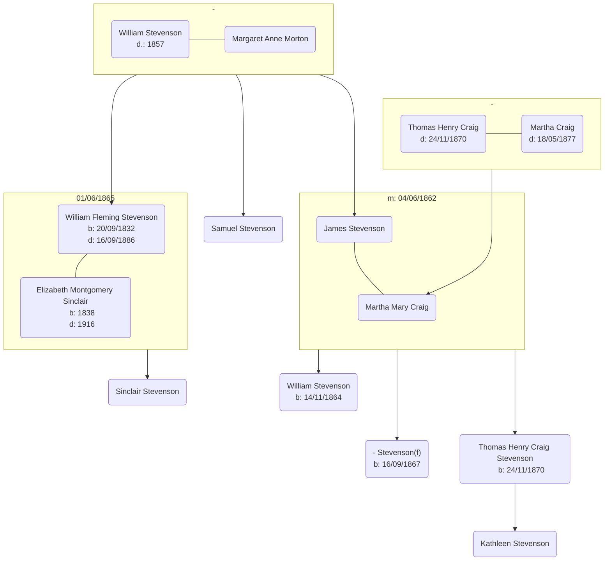

# Kathleen Stevenson

## Family Tree

## Events

- 04/06/1862 - [James Stevenson & Martha Craig Marriage][mjsmc] - James Stevenson (Merchant, Strabane), Martha Craig (Strabane), William Stevenson (Merchant, Strabane), Thomas Craig (Gentleman, Strabane) - [Leckpatrick Presbyterian Church][leckpatrick]
- 14/11/1864 - [William Stevenson Birth][bws] - Father: James Stevenson (Ironmonger), Mother: Martha Mary Stevenson (nee Craig), Strabane
- 01/06/1865 - [William Flemming Stevenson & Elizabeth Montgomery Sinclair Marriage][mwfsems]: William Fleming Stevenson (Clergyman, Dublin), Elizabeth Sinclair (Belfast), William Stevenson (Merchant), John Sinclair (Merchant) - Belfast
- 16/09/1867 - [Stevenson Birth (female)][bfs] - Father: James Stevenson (Merchant), Mother: Martha Stevenson (nee Craig), [Bowling Green, Strabane][bowling-green]
- 24/11/1870 - [Thomas Henry Craig Stevenson Birth][bthcs] - Father: James Stevenson (Merchant), Mother: Martha Stevenson (nee Craig), Bowling Green, Strabane - [Londonderry Journal](https://www.cotyroneireland.com/surnames/stevenson3.html)
- 1870 - Thomas Craig Death
- 18/05/1877 - [Martha Craig Death][dmc1] - Widow, 68 - Ardcoen House, Strabane - [Newspaper Record](https://www.genealogy.com/forum/surnames/topics/stevenson/3206/)
- 10/08/1886 - [James Stevenson Death][djs] - Iron Founder, 63, Ardstraw, Strabane
- 16/09/1886 - [Wiiliam Fleming Stevenson Death][dwfs] - Presbyterian Minister, 53 [Biography][biowfs]
- 12/09/1932 - Thomas Henry Craig Stevenson Death - [Obituary 1][othcs1], [2][othcs2]

## Wikipedia

- [Thomas Henry Craig Stevenson](https://en.wikipedia.org/wiki/T._H._C._Stevenson)

[bws]: ./william-stevenson-birth-2321710.pdf
[bfs]: ./f-stevenson-birth-2276746.pdf
[bthcs]: ./thomas-stevenson-birth-2218341.pdf
[mjsmc]: ./james-stevenson-martha-craig-marriage-5495910.pdf
[mwfsems]: ./william-f-stevenson-elizabeth-sinclair-marriage-8257038.pdf
[djs]: ./james-stevenson-death-4863545.pdf
[dmc1]: ./martha-craig-1-death-7210651.pdf
[dwfs]: ./william-fleming-stevenson-death-4784432.pdf
[biowfs]: https://www.dib.ie/biography/stevenson-william-fleming-a8294
[leckpatrick]: https://maps.app.goo.gl/GLChqzaDe9irynTAA
[bowling-green]: https://maps.app.goo.gl/ThU7yL2vC82EjYhE9
[othcs1]: ./THC%20Stevenson%20obit%20brmedj07406-0038.pdf
[othcs2]: ./THC%20Stevenson%20obit%203.pdf
