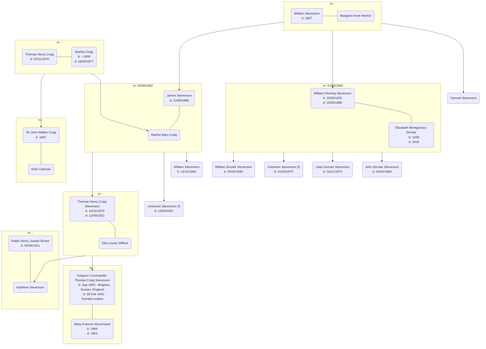

# Kathleen Stevenson

## Family Tree

## Events

- 1847 - [Sir John Walker Craig Birth][wwjwc] [ref (p74)][wwljwc]
- 04/06/1862 - [James Stevenson & Martha Craig Marriage][mjsmc] - James Stevenson (Merchant, Strabane), Martha Craig (Strabane), William Stevenson (Merchant, Strabane), Thomas Craig (Gentleman, Strabane) - [Leckpatrick Presbyterian Church][leckpatrick]
- 14/11/1864 - [William Stevenson Birth][bws] - Father: James Stevenson (Ironmonger), Mother: Martha Mary Stevenson (nee Craig), Strabane
- 01/06/1865 - [William Flemming Stevenson & Elizabeth Montgomery Sinclair Marriage][mwfsems]: William Fleming Stevenson (Clergyman, Dublin), Elizabeth Sinclair (Belfast), William Stevenson (Merchant), John Sinclair (Merchant) - Belfast
- 16/09/1867 - [Stevenson Birth (female)][bfs] - Father: James Stevenson (Merchant), Mother: Martha Stevenson (nee Craig), [Bowling Green, Strabane][bowling-green]
- 04/02/1868 - [John Sinclair Stevenson][bjss] - Father: Rev. William Fleming Stevenson (Presbyterian Minister), Mother: Elizabeth Montgomery Stevenson (nee Sinclair) - [Orwell Bank, Orwell Road, Rathgar, Dublin][orwell]
- 25/05/1870 - [Lilian Sinclair Stevenson][blss] - Father: Rev. William Fleming Stevenson (Presbyterian Minister), Mother: Elizabeth Montgomery Stevenson (nee Sinclair) - [Orwell Bank, Orwell Road, Rathgar, Dublin][orwell]
- 24/11/1870 - [Thomas Henry Craig Stevenson Birth][bthcs] - Father: James Stevenson (Merchant), Mother: Martha Stevenson (nee Craig), Bowling Green, Strabane - [Londonderry Journal](https://www.cotyroneireland.com/surnames/stevenson3.html)
- 1870 - Thomas Craig Death
- 01/03/1875 - [Unknown Stevenson (f) Birth] - Father: Rev. William Fleming Stevenson (Presbyterian Minister), Mother: Elizabeth Montgomery Stevenson (nee Sinclair) - [Orwell Bank, Orwell Road, Rathgar, Dublin][orwell]
- 18/05/1877 - [Martha Craig Death][dmc1] - Widow, 68 - Ardcoen House, Strabane - [Newspaper Record](https://www.genealogy.com/forum/surnames/topics/stevenson/3206/)
- 25/05/1883 - [William Sinclair Stevenson][bwss] - Father: Rev. William Fleming Stevenson (Presbyterian Minister), Mother: Elizabeth Montgomery Stevenson (nee Sinclair) - [Orwell Bank, Orwell Road, Rathgar, Dublin][orwell]
- 10/08/1886 - [James Stevenson Death][djs] - Iron Founder, 63, Ardcoen, Strabane
- 16/09/1886 - [Wiliam Fleming Stevenson Death][dwfs] - Presbyterian Minister, 53 [Biography][biowfs]
- 10/10/1888 - Thomas Henry Craig Stephenson, Strabane Academy to Trinity College Dublin, Tutor: [Dr L C Purser][purser] [Freeman's Journal][fj], [Admissions Records 1877-1910, Trinity College Dublin, p229-230][thcs-tcd1] [screenshot][thcs-tcdss1], [Index to Admissions Records, 1880-1896, Trinity College Dublin, p142][thcs-tcd2] [screenshot][thcs-tcdss2]
- 12/09/1932 - Thomas Henry Craig Stevenson Death - [Obituary 1][othcs1], [2][othcs2]
- 28/02/1942 [Commander Surgeon Thomas Craig Stevenson](./commander-surgeon-thomas-craig-stevenson-CWGC-certificate.pdf) ([CWGC](https://www.cwgc.org/find-records/find-war-dead/casualty-details/2488354/thomas-craig-stevenson/))

## Wikipedia

- [Thomas Henry Craig Stevenson](https://en.wikipedia.org/wiki/T._H._C._Stevenson)

## Thomas Henry Craig Stevenson Citations

- 07/1903 - [Newsholme, A., & Stevenson, T. H. C. (1903). The Graphic Method of Constructing a Life Table Illustrated by the Brighton Life Table, 1891-1900. The Journal of Hygiene, 3(3), 297–324.](./newsholme-stevenson-the-graphic-method-of-constructing-a-life-table-illustrated-by-the-brighton-life-table-18911900.pdf) [DOI](https://doi.org/10.1017/S002217240003285X)
- 04/1904 - [Stevenson, T. (1904). A Method of Estimating Future Populations. Journal of Hygiene, 4(2), 207-216.](./stevenson-a-method-of-estimating-future-populations.pdf) [DOI](https://doi.org/10.1017/S0022172400002138)
- 04/1905 - [Newsholme, A., & Stevenson, T. (1905). An Improved Method of calculating Birth-Rates. Journal of Hygiene, 5(2), 175-184.](./newsholme-stevenson-an-improved-method-of-calculating-birth-rates.pdf) [DOI](https://doi.org/10.1017/S0022172400002436)
- 06/1905 - [Newsholme, A., & Stevenson, T. (1905). An Improved Method of calculating Birth-Rates. Part II. Results. Journal of Hygiene, 5(3), 304-310.](./newson-stevenson-an-improved-method-of-calculating-birth-rates-part-ii-results.pdf) [DOI](https://doi.org/10.1017/S0022172400002576)
- 03/1906 - [Newsholme, A., & Stevenson, T. H. C. The Decline of Human Fertility in the United Kingdom and Other Countries as shown by Corrected Birth-Rates. Journal of the Royal Statistical Society, 69(1), 34–87.](https://www.jstor.org/stable/2339549) [DOI](https://doi.org/10.2307/2339549) | [Download from the Welcome Collection](./the-decline-of-human-fertility.pdf) [DOI](https://wellcomecollection.org/works/cqakk5pv)
- 06/1910 - [Stevenson, T. H. C. (1910). Suggested Lines of Advance in English Vital Statistics. Journal of the Royal Statistical Society, 73(6/7), 685–713.](https://www.jstor.org/stable/2339921) [DOI](https://doi.org/10.2307/2339921)
- [The Tabulation of Vital Statistics . Nature 84, 130 (1910)](./the-tabulation-of-vital-statistics.pdf) [DOI](https://doi.org/10.1038/084130a0)
- 05/1920 - [Stevenson, T. H. C. (1920). The Fertility of Various Social Classes in England and Wales from the Middle of the Nineteenth Century to 1911. Journal of the Royal Statistical Society, 83(3), 401–444.](https://www.jstor.org/stable/2340958) [DOI](https://doi.org/10.2307/2340958)
- 01/1921 - [Stevenson, T. H. C. (1921). The Incidence of Mortality Upon the Rich and Poor Districts of Paris and London. Journal of the Royal Statistical Society, 84(1), 90–99.](https://www.jstor.org/stable/2340592) [DOI](https://doi.org/10.2307/2340592)
- 12/1923 - [Stevenson, T. H. C, Social distribution of mortality from different causes in England and Wales 1910-12. Biometrika, Vol 15, Issue 3-4, p382–401](https://academic.oup.com/biomet/article-abstract/15/3-4/382/201418), [DOI](https://doi.org/10.1093/biomet/15.3-4.382)
- 01/1925 - [Stevenson, T. H. C. (1925). The Laws Governing Population. Journal of the Royal Statistical Society, 88(1), 63–90.](https://www.jstor.org/stable/2341577) [DOI](https://doi.org/10.2307/2341577)
- 01/1925 - [Stevenson T H C. The Rural Practitioner and Maternity. Br Med J 1925; 1 :191](./stevenson-bmj-191.1.extract.jpg) [DOI](https://doi.org/10.1136/bmj.1.3343.191)
- 03/1928 - [Stevenson, T. H. C. (1928). The Vital Statistics of Wealth and Poverty. Journal of the Royal Statistical Society, 91(2), 207–230.](https://www.jstor.org/stable/2341530) [DOI](https://doi.org/10.2307/2341530)
- 05/1929 - [Stevenson, T. H. C. (1929). Social Distribution of Mortality in England and Wales. The Journal of State Medicine (1912-1937), 37(5), 249–257.](http://www.jstor.org/stable/45207521)
- 11/1932 - [Stevenson, T. H. C. (1932). The Lure of Vital Statistics. The Journal of State Medicine (1912-1937), 40(11), 621–627.](http://www.jstor.org/stable/45208152)

[bws]: ./william-stevenson-birth-2321710.pdf
[bfs]: ./f-stevenson-birth-2276746.pdf
[bthcs]: ./thomas-stevenson-birth-2218341.pdf
[mjsmc]: ./james-stevenson-martha-craig-marriage-5495910.pdf
[bjss]: ./john-sinclair-stevenson-birth-2268747.pdf
[blss]: ./lilian-sinclair-stevenson-birth-2218711.pdf
[bwss]: ./william-sinclair-stevenson-birth-2006376.pdf
[mwfsems]: ./william-f-stevenson-elizabeth-sinclair-marriage-8257038.pdf
[djs]: ./james-stevenson-death-4786804.pdf
[dmc1]: ./martha-craig-1-death-7210651.pdf
[dwfs]: ./william-fleming-stevenson-death-4784432.pdf
[biowfs]: https://www.dib.ie/biography/stevenson-william-fleming-a8294
[wwjwc]: ./Thom's_Irish_who's_who.djvu.jpg
[wwljwc]: https://ia600207.us.archive.org/26/items/thomsirishwhoswh00dubl/thomsirishwhoswh00dubl.pdf
[leckpatrick]: https://maps.app.goo.gl/GLChqzaDe9irynTAA
[orwell]: https://maps.app.goo.gl/usX7UikGVtvz74wR6
[bowling-green]: https://maps.app.goo.gl/ThU7yL2vC82EjYhE9
[fj]: https://soc.genealogy.ireland.narkive.com/GbOUCUoP/excerpts-from-irish-newspapers
[purser]: https://en.wikipedia.org/wiki/Louis_Claude_Purser
[thcs-tcd1]: https://digitalcollections.tcd.ie/concern/works/h989r5354
[thcs-tcd2]: https://digitalcollections.tcd.ie/concern/works/41687k72w
[thcs-tcdss1]: ./thcs-trinity-entrance-1.png
[thcs-tcdss2]: ./thcs-trinity-entrance-2.png
[othcs1]: ./THC%20Stevenson%20obit%20brmedj07406-0038.pdf
[othcs2]: ./THC%20Stevenson%20obit%203.pdf
