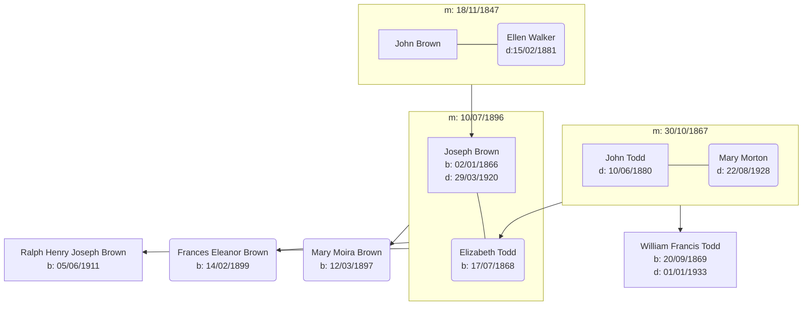

# Ralph Brown - Irish Records

## Family Tree

## Events

- 18/11/1847 - [John Brown & Ellen Walker Marriage][mjbew] - [Church of Kilmore][kilmore], Armagh
- 02/01/1866 - [Joseph Brown Birth][bjb]- Father John Brown (Farmer) - Mother: Ellen Brown (nee Walker) - [Creenagh, Armagh][creenagh]
- 30/10/1867 - [John Todd & Mary Morton Marriage][mjtmm] - John: Tankardstown, Co Laois - Mary: Clonliffe, Co. Dublin - near [St Mary's Chapel of Ease, Dublin][marys]
- 17/07/1868 - [Elizabeth Todd Birth][bet] - Father: John Todd (Farmer) - Mother: Mary Todd (nee Morton) - [Tankerstown, Ballylinan, Queen's County (County Laois)][tankerstown]
- 20/09/1869 - [William Francis Todd Birth][bwt] - Father: John Todd (Farmer) - Mother: Mary Todd (nee Morton) - [Tankerstown, Ballylinan, Queen's County (County Laois)][tankerstown]
- 10/06/1880 - [John Todd Death][djt] - Farmer, Age 40 - [Farnham House, Finglas, Dublin (Mental Hospital)][finglas]
- 15/02/1881 - [Ellen Brown Death][deb] - Farmer's Widow, Age 59 - Richhill, Armagh
- 10/07/1896 - [Joseph Brown & Elizabeth Todd Marriage][mjbet] - Joseph: [79 Wellington Road, Dublin][wellington] - Elizabeth [13 Earlsfort Terrace][earlsfort] - [St Mathius Church, Killiney, Dublin][mathius]
- 12/03/1897 - [Mary Moira Brown Birth][bmb] - Father: Joseph Brown (School Master), Mother: Elizabeth Brown - [5 Richmond Hill, Monkstown, Dublin][richmond]
- 14/02/1899 - [Frances Ellen Brown Birth][bfb] - Father: Joseph Brown (School Master), Mother: Elizabeth Brown - [Bellevue, Sutton, Dublin][bellevue]
- 31/03/1901 - [1901 Census][1901] - Joseph Brown (Age 35, School Master), Elizabeth Brown (Age 32), Mary Moira Brown (Age 4), Frances Eleanor Brown (Age 2)
- 02/04/1911 - [1911 Census][1911-1], [p2][1911-2] - Elizabeth Brown (Age 42), Mary Moira Brown (Age 14), Frances Eleanor Brown (Age 12), Mary Morton Todd (Age 69), William Francis Todd (Age 41, Barister at Law)
- 05/06/1911 - [Ralph Henry Joseph Brown Birth][brb] - Father: Joseph Brown (Professor), Mother: Elizabeth Brown - [Mandeville, Torquay Road, Foxrock, Dublin][Mandeville]
- 29/03/1920 - [Joseph Brown Death][djb] - Professor of Mathematics, Age 53 - [Mandeville, Torquay Road, Foxrock, Dublin][Mandeville]
- 22/08/1928 - [Mary Morton Todd Death][dmt] - Widow, Age 87 - 6 Fortfield Villas, Rathborne, Dublin
- 01/01/1933 - [William Francis Todd Death][dwt] - Independant Means, Age 62 - Foxrock, Dublin

## Published

- 01/08/1936 - [The Beams Ultracentrifuge, Nature][ultracentrifuge] - W. Cusak Fahie & Ralph H. J. Brown
- 14/11/1936 - [Effect of Large Centrifugal Force on Paramecium, Nature][paramecium] - W. Cusak Fahie & Ralph H. J. Brown

[mjbew]: john-brown-ellen-walker-marriage-5375131.pdf
[mjtmm]: john-todd-mary-morton-marriage-8233829.pdf
[mjbet]: joseph-brown-elizabeth-todd-marriage-5837578.pdf
[bjb]: joseph-brown-birth-2304677.pdf
[bet]: elizabeth-brown-todd-birth-2258204.pdf
[bwt]: william-todd-birth-2236072.pdf
[bmb]: moira-brown-birth-1809338.pdf
[bfb]: frances-brown-birth-1781727.pdf
[brb]: ralph-brown-birth-1617248.pdf
[djt]: john-todd-death-4860229.pdf
[deb]: ellen-brown-death-4854649.pdf
[djb]: joseph-brown-death-4410453.pdf
[dmt]: mary-morton-todd-death-4347261.pdf
[dwt]: william-todd-death-4316053.pdf
[kilmore]: https://goo.gl/maps/Q34u7aQVfcHRMDyk9
[creenagh]: https://goo.gl/maps/nqLH15nnbTRxAA297
[marys]: https://goo.gl/maps/DkE3m2JsXR6dBEHd6
[tankerstown]: https://goo.gl/maps/hnw2fLqUDeG5CqEu7
[finglas]: https://goo.gl/maps/pfB8CJmqyQZnPiV9A
[wellington]: https://goo.gl/maps/StfrexiN9JsizqLB8
[earlsfort]: https://goo.gl/maps/NmMjo6xdYMQnetGG7
[mathius]: https://goo.gl/maps/XMNLwS7DaekfCEn68
[richmond]: https://goo.gl/maps/VkzwNNJ19ogkasV36
[bellevue]: https://goo.gl/maps/qydNZgZp45QjVjuS7
[Mandeville]: https://goo.gl/maps/hHANsYPr6JrsAyFU6
[ultracentrifuge]: 138207b0.pdf
[paramecium]: 138843a0.pdf
[1901]: 1901-census.pdf
[1911-1]: 1911-census-1.pdf
[1911-2]: 1911-census-2.pdf
