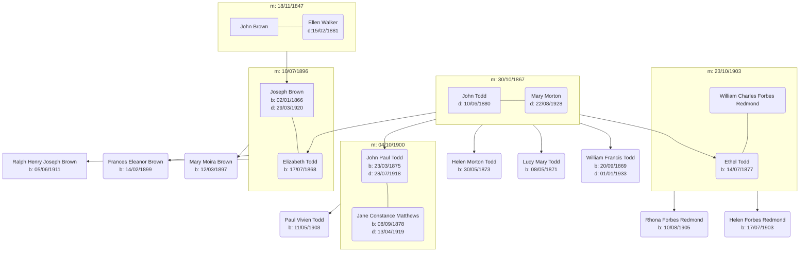

# Ralph Brown - Irish Records

## Family Tree

## Events

- 18/11/1847 - [John Brown & Ellen Walker Marriage][mjbew] - [Church of Kilmore][kilmore], Armagh
- 02/01/1866 - [Joseph Brown Birth][bjb]- Father John Brown (Farmer) - Mother: Ellen Brown (nee Walker) - [Creenagh, Armagh][creenagh]
- 30/10/1867 - [John Todd & Mary Morton Marriage][mjtmm] - John: [Tankardstown, Co Laois][tankardstown] - Mary: Clonliffe, Co. Dublin - near [St Mary's Chapel of Ease, Dublin][marys]
- 17/07/1868 - [Elizabeth Todd Birth][bet] - Father: John Todd (Farmer) - Mother: Mary Todd (nee Morton) - [Tankardstown, Ballylinan, Queen's County (County Laois)][tankardstown]
- 20/09/1869 - [William Francis Todd Birth][bwt] - Father: John Todd (Farmer) - Mother: Mary Todd (nee Morton) - [Tankerstown, Ballylinan, Queen's County (County Laois)][tankerstown]
- 10/06/1880 - [John Todd Death][djt] - Farmer, Age 40 - [Farnham House, Finglas, Dublin (Mental Hospital)][finglas]
- 15/02/1881 - [Ellen Brown Death][deb] - Farmer's Widow, Age 59 - Richhill, Armagh
- 10/07/1896 - [Joseph Brown & Elizabeth Todd Marriage][mjbet] - Joseph: [79 Wellington Road, Dublin][wellington] - Elizabeth [13 Earlsfort Terrace][earlsfort] - [St Mathius Church, Killiney, Dublin][mathius]
- 12/03/1897 - [Mary Moira Brown Birth][bmb] - Father: Joseph Brown (School Master), Mother: Elizabeth Brown - [5 Richmond Hill, Monkstown, Dublin][richmond]
- 14/02/1899 - [Frances Ellen Brown Birth][bfb] - Father: Joseph Brown (School Master), Mother: Elizabeth Brown - [Bellevue, Sutton, Dublin][bellevue]
- 04/10/1900 - [John Todd & Jane Matthews Marriage][mjtjm] - John: Mechanical Engineer, [4 Haddon Terrace, Clontarf, Dublin][haddon], Jane: [Salem House, Rathmines, Dublin][salem]
- 31/03/1901 - [1901 Census][1901] - Joseph Brown (Age 35, School Master), Elizabeth Brown (Age 32), Mary Moira Brown (Age 4), Frances Eleanor Brown (Age 2)
- 11/05/1903 - [Paul Vivien Todd][pvt] - Father: John Paul Todd (Engineer), Mother: Jane Constance Todd - [4 Haddon Terrace, Clontarf, Dublin][haddon]
- 17/07/1903 - [Helen Molly Forbes Redmond][hmfr] - Father: William Charles Forbes Redmond, Mother: Ethel Todd - Church Street, Mountmellick
- 23/10/1903 - [William Charles Forbes Redmond & Ethel Todd Marriage][mwreth] - William: Electrical Engineer, Newcastle on Tyne, Ethel: Howth, Dublin
- 10/08/1905 - [Rhona Forbes Redmond][rfr] - Father: William Charles Forbes Redmond, Mother: Ethel Todd - Church Street, Mountmellick
- 02/04/1911 - [1911 Census][1911-1], [p2][1911-2] - Elizabeth Brown (Age 42), Mary Moira Brown (Age 14), Frances Eleanor Brown (Age 12), Mary Morton Todd (Age 69), William Francis Todd (Age 41, Barister at Law)
- 05/06/1911 - [Ralph Henry Joseph Brown Birth][brb] - Father: Joseph Brown (Professor), Mother: Elizabeth Brown - [Mandeville, Torquay Road, Foxrock, Dublin][Mandeville]
- 28/07/1918 - [John Paul Todd][djpt] - Civil Engineer, Age 43 - [Mandeville, Torquay Road, Foxrock, Dublin][Mandeville]
- 29/03/1920 - [Joseph Brown Death][djb] - Professor of Mathematics, Age 53 - [Mandeville, Torquay Road, Foxrock, Dublin][Mandeville]
- 22/08/1928 - [Mary Morton Todd Death][dmt] - Widow, Age 87 - 6 Fortfield Villas, Rathborne, Dublin
- 01/01/1933 - [William Francis Todd Death][dwt] - Independant Means, Age 62 - [Gordon Avenue, Foxrock, Dublin][gordonave]

## Citations

- 01/Aug/1936 - [Fahie, W., Brown, R. The Beams Ultracentrifuge. Nature 138, 207 (1936)](138207b0.pdf) [DOI](https://doi.org/10.1038/138207b0)
- 14/Nov/1936 - [Brown, R. Effect of Large Centrifugal Forces on Paramecium. Nature 138, 843 (1936)](138843a0.pdf) [DOI](https://doi.org/10.1038/138843a0)
- 01/Jul/1940 - [Brown, R. H. J. 1940 The Protoplasmic Viscosity of Paramecium. J Exp Biol 17 (3): 317–324.](jexbio_17_3_317.pdf) [DIO](https://doi.org/10.1242/jeb.17.3.317)
- 01/Dec/1948 - [Brown, R. H. J. 1948 The flight of birds. I. The flapping cycle of the pigeon. J Exp Biol 25, 322–333. Br.170.010](jexbio_25_4_322.pdf) [DOI](https://doi.org/10.1242/jeb.25.4.322)
- 01/Jul/1951 - Brown, R. H. J. 1951 Flapping flight. Ibis 93, 333–359. Br.170.020 [DOI]( https://doi.org/10.1111/j.1474-919X.1951.tb05439.x)
- 01/Mar/1953 - [Ramsay, J. A., Brown, R. H. J., Falloon S. W. H. W. 1953 Simultaneous Determination of Sodium and Potassium in Small Volumes of Fluid by Flame Photometry. J Exp Biol 30, 1–17.](jexbio_30_1_1.pdf) [DOI](https://doi.org/10.1242/jeb.30.1.1)
- 01/Mar/1953 - [Brown, R. H. J. 1953 The flight of birds. II. Wing function in relation to flight speed. J Exp Biol 30, 90–103. Br.170.030](jexbio_30_1_90.pdf) [DOI](https://doi.org/10.1242/jeb.30.1.90)
- 01/Dec/1955 - [Ramsay, J. A., Brown, R. H. J., Croghan, P. C., 1955 Electrometric Titration of Chloride in Small Volumes. J Exp Biol 32 4, 822–829.](jexbio_32_4_822.pdf) [DOI](https://doi.org/10.1242/jeb.32.4.822)
- 03/Dec/1955 - [Animal Movement. Nature 176, 1060–1061 (1955)](1761060a0.pdf) [DOI](https://doi.org/10.1038/1761060a0)
- 01/Mar/1958 - [Bainbridge, Richard, Brown, R. H. J. 1958 An Apparatus for the Study of the Locomotion of Fish. J Exp Biol 35, 134–137.](jexbio_35_1_134.pdf) [DOI](https://doi.org/10.1242/jeb.35.1.134)
- 01/Jun/1959 [Parry, D. A. and Brown, R. H. J. (1959a). The hydraulic mechanism of the spider leg. J Exp Biol 36, 423-433.](jexbio_36_2_423.pdf) [DOI](https://doi.org/10.1242/jeb.36.2.423)
- 01/Dec/1959 - [Parry, D. A. and Brown, R. H. J. (1959b). The jumping mechanism of salticid spiders. J Exp Biol 36, 654-664.](jexbio_36_4_654.pdf) [DOI](https://doi.org/10.1242/jeb.36.4.654)
- 1961 - Brown, R. H. J. 1961. Flight. In Biology and comparative physiology of birds, ed. A. J. Marshall, vol. 2, pp. 289–305. London: Academic Press. Br.170.050 [DOI](https://doi.org/10.1016/B978-1-4832-3143-3.50015-0)
- 1961 - Brown, R. H. J. 1961 Power requirements of birds in flight. Symp. zool. Soc. Lond. 5, 95–99. Br.170.040
- 01/Nov/1963 - Brown, R. H. J. 1963 The flight of birds. Biol. Rev. 38, 460–489. Br.170.060 [DOI]( https://doi.org/10.1111/j.1469-185X.1963.tb00790.x)
- 27/May/1967 - [Brown, R. H. J. 1967. Mechanism of locust jumping. Nature (Lond.) 214, 939.](214939a0.pdf) - The first paper to describe how the lever ratios of the muscles change with joint angle. - [DOI](https://doi.org/10.1038/214939a0)
- 01/Feb/1968 - [Chase, Ann M., Unwin, D. M., Brown, R. H. J. 1968 A Simple Electrolytic Respirometer for the Continuous Recording of Oxygen Consumption Under Constant and Natural Conditions. J Exp Biol 48, 207–215](jexbio_48_1_207.pdf) [DOI](https://doi.org/10.1242/jeb.48.1.207)

[mjbew]: ./john-brown-ellen-walker-marriage-5375131.pdf
[mjtmm]: ./john-todd-mary-morton-marriage-8233829.pdf
[mjbet]: ./joseph-brown-elizabeth-todd-marriage-5837578.pdf
[mjtjm]: ./john-todd-jane-matthews-marriage-5772814.pdf
[mwreth]: ./william-redmond-ethel-todd-5742493.pdf
[bjb]: ./joseph-brown-birth-2304677.pdf
[bet]: ./elizabeth-brown-todd-birth-2258204.pdf
[bwt]: ./william-todd-birth-2236072.pdf
[bmb]: ./moira-brown-birth-1809338.pdf
[bfb]: ./frances-brown-birth-1781727.pdf
[pvt]: ./paul-vivien-todd-birth-1727954.pdf
[hmfr]: ./helen-redmond-birth-1724020.pdf
[rfr]: ./rhona-redmond-birth-1697082.pdf
[brb]: ./ralph-brown-birth-1617248.pdf
[djt]: ./john-todd-death-4860229.pdf
[deb]: ./ellen-brown-death-4854649.pdf
[djpt]: ./john-todd-death-4430338.pdf
[djb]: ./joseph-brown-death-4410453.pdf
[dmt]: ./mary-morton-todd-death-4347261.pdf
[dwt]: ./william-todd-death-4316053.pdf
[kilmore]: https://goo.gl/maps/Q34u7aQVfcHRMDyk9
[creenagh]: https://goo.gl/maps/nqLH15nnbTRxAA297
[marys]: https://goo.gl/maps/DkE3m2JsXR6dBEHd6
[tankardstown]: https://maps.app.goo.gl/BDjz9EY39gp7a42WA
[finglas]: https://goo.gl/maps/pfB8CJmqyQZnPiV9A
[wellington]: https://goo.gl/maps/StfrexiN9JsizqLB8
[earlsfort]: https://goo.gl/maps/NmMjo6xdYMQnetGG7
[mathius]: https://goo.gl/maps/XMNLwS7DaekfCEn68
[richmond]: https://goo.gl/maps/VkzwNNJ19ogkasV36
[haddon]: https://maps.app.goo.gl/RdHuKJYQ1ZXKun7d8
[salem]: https://maps.app.goo.gl/kBprUAKCNCHG4X2u5
[bellevue]: https://goo.gl/maps/qydNZgZp45QjVjuS7
[Mandeville]: https://goo.gl/maps/hHANsYPr6JrsAyFU6
[gordonave]: https://maps.app.goo.gl/xHfGjCEgfVPuhS6E9
[1901]: ./1901-census.pdf
[1911-1]: ./1911-census-1.pdf
[1911-2]: ./1911-census-2.pdf
